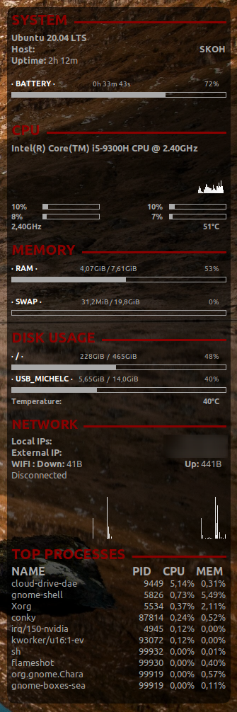

# my conky configuration

Here is my "conkyrc" file that I use for my gnome desktop with Ubuntu. I gleaned information here and there to write it down.
This page references all possible commands:<a href="http://conky.sourceforge.net/variables.html">http://conky.sourceforge.net/variables.html</a>

You will first need to download the "conky" package and place the conkyrc file on the personal folder. (I advise you to put it in a hidden file: .conkyrc)
<code>sudo apt install conky</code>
To automate it, you will need to go to the "Startup applications" application. Then add the "conky" command.

And there, miraculously, the file runs on its own.

**You will see**

* System
  + Systèmes infos
  + Uptime and time left until charged or remaining time
* CPU 
  + CPU infos
  + Graph
* Memory
  + RAM usage
  + SWAP usage
* Disk usage
  + root usage
  + home usage
  + temperature for an HDD disk
* Network
  + Local IPs
  + External IPs
  + Spped up and down
  + Graph for each up and down
* Top processes

Have fun.

SKOH

