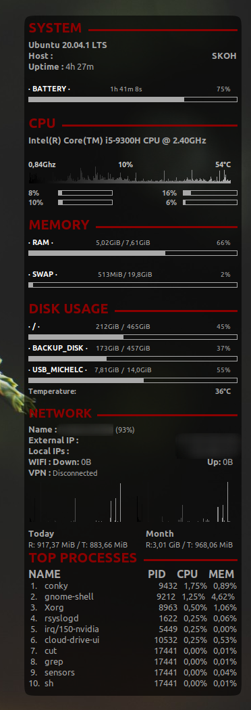

# my conky configuration


Attribution-NonCommercial-ShareAlike 4.0 International (CC BY-NC-SA 4.0)

Here is my "conkyrc" file that I use for my gnome desktop with Ubuntu. I gleaned information here and there to write it down.
This page references all possible commands:<a href="http://conky.sourceforge.net/variables.html">http://conky.sourceforge.net/variables.html</a>

You will first need to download the "conky" package and place the conkyrc file on the personal folder. (I advise you to put it in a hidden file: .conkyrc)
<code>sudo apt install conky</code>
To automate it, you will need to go to the "Startup applications" application. Then add the "conky" command.

The "draw_bg.lua" file is there for background configurations because I wanted rounded corners for the conky window.

And there, miraculously, the file runs on its own.

**You will see**

* System
  + Systèmes infos
  + Uptime and time left until charged or remaining time
* CPU
  + CPU infos
  + Graph
* Memory
  + RAM usage
  + SWAP usage
* Disk usage
  + root usage
  + home usage
  + temperature for an HDD disk
* Network
  + Local IPs
  + External IPs
  + Spped up and down
  + Graph for each up and down
* Top processes

Have fun.

SKOH



``` lua_loadconky.config = {

  lua_load = "~/CloudStation/Documents/Scripts/linux_conky/draw_bg.lua",
  -- lua_startup_hook = "draw_bg",
  lua_draw_hook_pre = "draw_bg",
  -- lua_draw_hook_post = "conky_update",


  update_interval = 1,
  cpu_avg_samples = 4,
  net_avg_samples = 4,
  out_to_console = false,

  override_utf8_locale = true,
  double_buffer = true,
  no_buffers = true,
  text_buffer_size = 2048,
  imlib_cache_size = 0,


  own_window = true,
  own_window_transparent = true,
  own_window_class = 'Conky',
  own_window_type = 'dock',
  own_window_argb_visual = true,
  own_window_argb_value = 255,
  double_buffer = true,
  own_window_hints = 'undecorated,below,sticky,skip_taskbar,skip_pager',
  xinerama_head = 0,

  border_inner_margin = 5,
  border_outer_margin = 0,
  xinerama_head = 0,
  alignment = 'middle_right',
  gap_x = 20,
  gap_y = 0,


  draw_shades = false,
  draw_outline = false,
  draw_borders = false,
  draw_graph_borders = false,
  use_xft = true,
  font = 'Ubuntu Mono:size=10',
  xftalpha = 0,
  uppercase = false,
  default_color = 'darkgray',
  default_shade_color = '#1d1d1d',
  white = '#000000',

  own_window_colour = '#000000',
  minimum_width = 300, minimum_height = 0,


  template5 = [[
${if_mounted \2}#
${font Ubuntu:pixelsize=11:bold}${color white}· \1 · $alignc${color1}${font Ubuntu:pixelsize=10}${fs_used \2}  /  ${fs_size \2}#
${if_match ${fs_used_perc \2}>=75}${color b54}$else$color$endif#
${template8}${fs_used_perc \2}%$font$color
${if_match ${fs_used_perc \2}>=75}${color b54}$else$color$endif#
${fs_bar 7 \2}
$endif$color]],


  color1 = 'b9b9b7', -- secondary text color
  color2 = '2e7629',
  color3 = 'ccccca',
  color4 = '2f568b',
  template7 = '${alignc}',
  template8 = '${alignr 10}',

};
conky.text = [[
${font}${voffset -15}

${template8}${font Ubuntu:pixelsize=17:bold}${execi 1000 date "+%d %B"}  ${exec date "+%H:%M"}
${color4}${font Ubuntu:pixelsize=20:bold}SYSTEM  ${hr 3}$color
${font Ubuntu:pixelsize=13:bold}${exec lsb_release -d | cut -f2 }$alignr ${kernel}
${font Ubuntu:pixelsize=13:bold}Host : $alignr$nodename
${font Ubuntu:pixelsize=13:bold}Uptime : ${font Ubuntu:pixelsize=13:normal}$uptime_short

${font Ubuntu:pixelsize=11:bold}${color0}· BATTERY · $alignc${color1}${font Ubuntu:pixelsize=10}${battery_time}#
${if_match ${battery_percent BAT0}<=20}${color b54}\
${else}${if_match ${battery_percent BAT0} ==100}${color2}${endif}\
${endif}#
${template8}${battery_percent}%$font$color
${if_match ${battery_percent BAT0}<=20}${color b54}${battery_bar 7}\
${else}${if_match ${battery_percent BAT0} ==100}${color2}${battery_bar 7}${endif}\
${battery_bar 7}
${endif}#

${color4}${font Ubuntu:pixelsize=20:bold}CPU/GPU  ${hr 3}$color
${font Ubuntu:pixelsize=13:bold}${execi 1000 grep model /proc/cpuinfo | cut -d : -f2 | tail -1 | sed 's/\s//'}
${font Ubuntu:pixelsize=13:bold}${cpugraph 50,300 $color cpu}
$color3${voffset -47}${font Ubuntu:pixelsize=11:bold}${freq_g}Ghz$alignc${cpu cpu}%${if_match ${exec sensors | grep 'Core 0' | cut -c17-18}>=80}${color b54}$else$color3$endif#
${template8}${exec sensors | grep 'Core 0' | cut -c17-18}°C$color


#${font Ubuntu:pixelsize=11:bold}${cpu cpu1}%   ${cpubar cpu1 7,80} $alignr${cpu cpu2}%   ${cpubar cpu2 7,80}
#${font Ubuntu:pixelsize=11:bold}${cpu cpu3}%   ${cpubar cpu3 7,80} $alignr${cpu cpu4}%   ${cpubar cpu4 7,80}

${font Ubuntu:pixelsize=13:bold}${execi 1000 nvidia-smi -q | grep "Product Name" | cut -c45-60}\
${font Ubuntu:pixelsize=11:bold}$alignc${exec nvidia-smi -q | grep Gpu | cut -c45-46}%\
${font Ubuntu:pixelsize=11:bold}${template8}${if_match ${nvidia temp}>=70}${color b54}$else$color$endif#
${template8}${nvidia temp}°C
${color4}${font Ubuntu:pixelsize=20:bold}MEMORY  ${hr 3}$color
${font Ubuntu:pixelsize=11:bold}${color0}· RAM · $alignc${color1}${font Ubuntu:pixelsize=10}$mem / $memmax#
${if_match ${memperc}>=75}${color b54}$else$color$endif#
${template8}${memperc}%$font$color
${if_match ${memperc}>=75}${color b54}$else$color$endif#
${membar 7}
${font Ubuntu:pixelsize=11:bold}${color0}· SWAP · $alignc${color1}${font Ubuntu:pixelsize=10}$swap / $swapmax#
${if_match ${swapperc}>=75}${color b54}$else$color$endif#
${template8}${swapperc}%$font$color
${if_match ${swapperc}>=75}${color b54}$else$color$endif#
${swapbar 7}

${color4}${font Ubuntu:pixelsize=20:bold}DISK USAGE  ${hr 3}$color
${template5 / /}#
${template5 BACKUP_DISK /media/corentin/BACKUP_DISK}#
${template5 USB_MICHELC /media/corentin/USB_MICHELC}#
${template5 USB_31Go /media/corentin/USB_31Go}#
${font Ubuntu:pixelsize=11:bold}${if_match ${execi 10 sudo nvme smart-log /dev/nvme0 | grep 'temperature' | cut -c18-20}>=50}${color b54}$else$color$endif#
${template8}${execi 10 sudo nvme smart-log /dev/nvme0 | grep 'temperature' | cut -c18-20}°C
${color4}${font Ubuntu:bold:size=14}NETWORK  ${hr 3}$color
${if_gw}\
${font Ubuntu:pixelsize=13:bold}Name : ${font Ubuntu:pixelsize=11:normal}${alignc}${wireless_essid wlo1} (${wireless_link_qual_perc wlo1}%)
${font Ubuntu:pixelsize=13:bold}External IP :${font Ubuntu:pixelsize=13:normal}${alignc}${execi 30  wget -q -O- http://ipecho.net/plain; echo}
${font Ubuntu:pixelsize=13:bold}Local IPs :${font Ubuntu:pixelsize=13:normal}${alignc}${addrs wlo1}\
${else}\
${font Ubuntu:pixelsize=13:bold}No Connection${endif}
${font Ubuntu:pixelsize=13:bold}WIFI : Down: ${font Ubuntu:pixelsize=13:normal}${downspeed wlo1}  ${font Ubuntu:pixelsize=13:bold}${alignr}Up: ${font Ubuntu:pixelsize=13:normal}${upspeed wlo1}
${font Ubuntu:pixelsize=13:bold}VPN : ${font Ubuntu:pixelsize=11:normal}${texeci 30  protonvpn s | head -n 1 | cut -f2 -d ':' | tr -d ' '} ${texeci 30 protonvpn s | awk '/#/{print}' | cut -f2 -d ':' | tr -d ' '} ${texeci 30 protonvpn s | awk '/Protocol/{print}' | cut -f2 -d ':' | tr -d ' '}
${downspeedgraph wlo1 40,140 A9A9A9} ${alignr}${upspeedgraph wlo1 40,140 A9A9A9}
${font Ubuntu:pixelsize=13:bold}Today ${goto 180}Month
${font Ubuntu:pixelsize=11:normal}${execi 300 vnstat -i wlo1+enp3s0 | grep "today" | awk '{print "R: "$2" "$3" / T: "$5" "$6}'} ${goto 180}${execi 300 vnstat -i wlo1+enp3s0 -m | grep "`date +"%Y-%m"`" | awk '{print "R:"$2" "$3" / T: "$5" "$6}'}
${color4}${font Ubuntu:pixelsize=20:bold}TOP PROCESSES  ${hr 3}$color
${font Ubuntu:pixelsize=16:bold}NAME $alignr PID    CPU    MEM ${font Ubuntu:pixelsize=13:normal}
 1.${goto 30}${top name 1} $alignr ${top pid 1} ${top cpu 1}% ${top mem 1}%
 2.${goto 30}${top name 2} $alignr ${top pid 2} ${top cpu 2}% ${top mem 2}%
 3.${goto 30}${top name 3} $alignr ${top pid 3} ${top cpu 3}% ${top mem 3}%
 4.${goto 30}${top name 4} $alignr ${top pid 4} ${top cpu 4}% ${top mem 4}%
 5.${goto 30}${top name 5} $alignr ${top pid 5} ${top cpu 5}% ${top mem 5}%
 6.${goto 30}${top name 6} $alignr ${top pid 6} ${top cpu 6}% ${top mem 6}%
 7.${goto 30}${top name 7} $alignr ${top pid 7} ${top cpu 7}% ${top mem 7}%
 8.${goto 30}${top name 8} $alignr ${top pid 8} ${top cpu 8}% ${top mem 8}%
 9.${goto 30}${top name 9} $alignr ${top pid 9} ${top cpu 9}% ${top mem 9}%
10.${goto 30}${top name 10} $alignr ${top pid 10} ${top cpu 10}% ${top mem 10}%
${voffset -50}
]];
```
